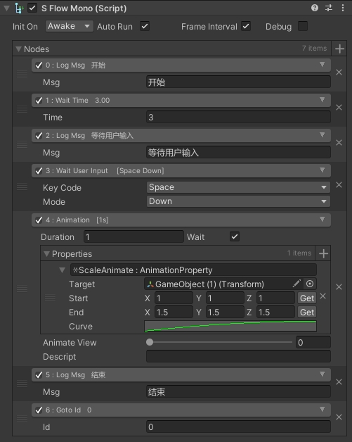

一个简单且基础的基于Odin Inspector的可视化工作流程框架.

环境要求：

- Odin Inspector 插件
- UniTask


 


框架里面包含了最基本的一些节点：

 


想要创建自己的节点也非常的容易：

```c#
sealed class MyNode : Node
{
    public override string descript => "这是自定义的节点";

    public override void Init(Arg arg)
    {
        //初始化内容
    }

    public override async UniTask Run(Arg arg)
    {
        //开始执行节点任务
    }
}
```